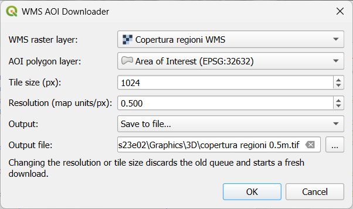

# WMS AOI Downloader for QGIS

A QGIS plugin that exports a high-resolution GeoTIFF from a WMS basemap, clipped
to a polygon area of interest (AOI).

It:
- Requests tiles with WMS `GetMap` across the bounding box of your AOI polygon.
- Throttles requests adaptively to stay within the server's rate limits.
- Tracks progress in a resumable SQLite queue, so an interrupted run continues
  where it left off.
- Mosaics the tiles into a compressed, tiled GeoTIFF (with overviews) and loads
  it into the project.

Written for QGIS 3.40.8.

## Installation

1. Copy this directory into your QGIS plugins folder:
   `$env:APPDATA\QGIS\QGIS3\profiles\default\python\plugins\`
2. In QGIS, open **Plugins ▸ Manage and Install Plugins ▸ Installed**.
3. Check the box next to **WMS AOI Downloader** to activate it.

The tool then appears under **Web ▸ WMS AOI Downloader…** and on the toolbar.

## Usage

### 1. Match the coordinate reference system

Make sure the project and layer CRS match your WMS source. To set the project
CRS, click the EPSG code in the bottom-right of the window and choose the CRS of
your source (for example, **EPSG:32632** for an Italian UTM-32 source).

### 2. Add the WMS basemap

Get the WMS URL from your map provider, then in QGIS:

- Open **Layer ▸ Data Source Manager ▸ WMS/WMTS** and click **New** to create a
  connection.
  - **Name** – e.g. `Copertura regioni WMS`
  - **URL** – e.g. `http://wms.pcn.minambiente.it/ogc?map=/ms_ogc/WMS_v1.3/raster/ortofoto_colore_12.map`
- Connect, then add the layer you want
  (e.g. *Italy Geoportale Nazionale Ortho (1m) ▸ Ortofoto a colori anno 2012 ▸
  Copertura … WGS84 - UTM32*).

### 3. Define the area of interest

Create a polygon layer to outline the region to export:

- **Layer ▸ Create Layer ▸ New Temporary Scratch Layer**
  - **Name** – e.g. `Area of Interest (EPSG:32632)`
  - **Geometry type** – Polygon
  - **CRS** – your project CRS

Then draw the boundary (e.g. roughly 10 × 10 km):

1. Center the target area on the canvas and set the scale to about 1:30,000.
2. Select the AOI layer in the **Layers** panel.
3. Enable editing (the yellow pencil in the toolbar).
4. Use **Add Polygon Feature** to draw the boundary: left-click to place each
   corner, then right-click to finish.
5. Turn editing off again and save the changes when prompted.

### 4. Export to GeoTIFF

Open **Web ▸ WMS AOI Downloader…** and set, for example:




| Setting | Example |
| --- | --- |
| WMS layer | `Copertura regioni WMS` |
| AOI polygon layer | `Area of Interest (EPSG:32632)` |
| Tile size | `1024` |
| Resolution | `0.5` |
| Output | `C:\Users\you\output.tif` (or a temporary file) |

Click **OK** to start. Progress is shown in the Task Manager, and the finished
mosaic is added to the project automatically.

## Q & A

**Why is my map blurry?**
Check that the resolution and the coordinate reference systems all match your
source.

**Why are some tiles missing?**
Most likely the request rate did not adapt quickly enough to server-side
throttling. Re-run the export — the resumable queue fills in the gaps.

**Which version of QGIS is this for?**
It was written for QGIS 3.40.8.

**Can I run it from the QGIS Python Console?**
Yes:

```python
from wms_aoi_downloader import core
core.run()
```

With no arguments it uses the default layer names and the defaults defined in
`core.py` (not the values last entered in the dialog). You can override them, e.g.:

```python
core.run(tile_pixels=1024, target_resolution=0.5, output_path=r"C:\Users\you\output.tif")
```
